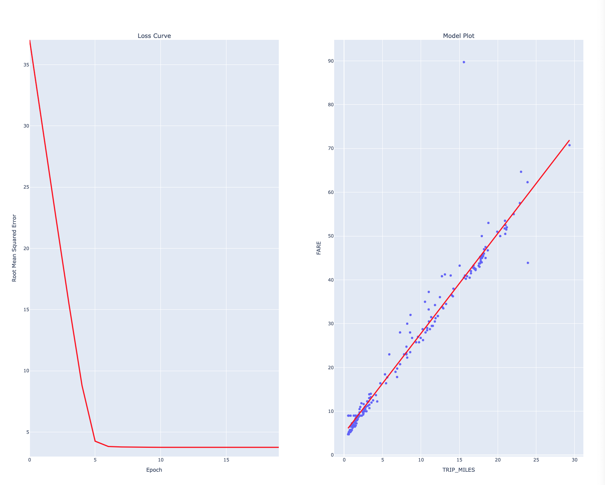
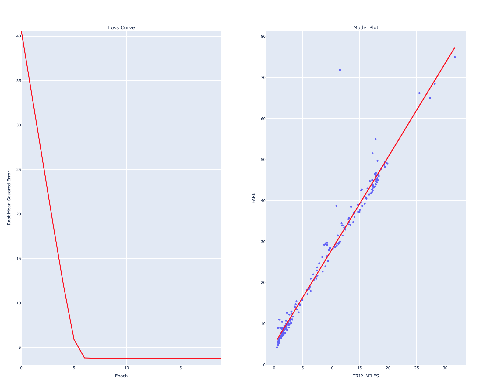
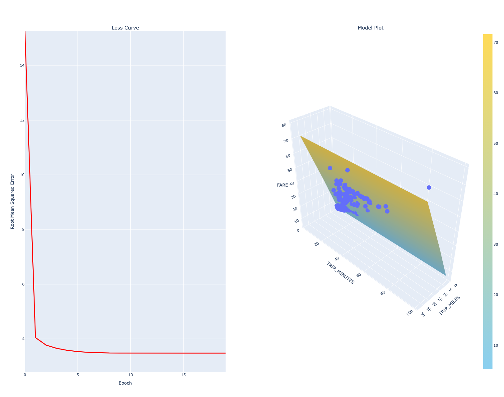

# Machine learning 
## Linear Regression Taxi 
### Train a model with one feature
Training a Model to predict the cost of the fare using a single feature. This exemple use TRIP_MILES as the feature for training run. 

### Experiment with hyperparameters
Multiple experiments to find the best set of hyperparameters to train a model.

#### Train a model with two features
Training the model with two features, TRIP_MILES and TRIP_MINUTES

