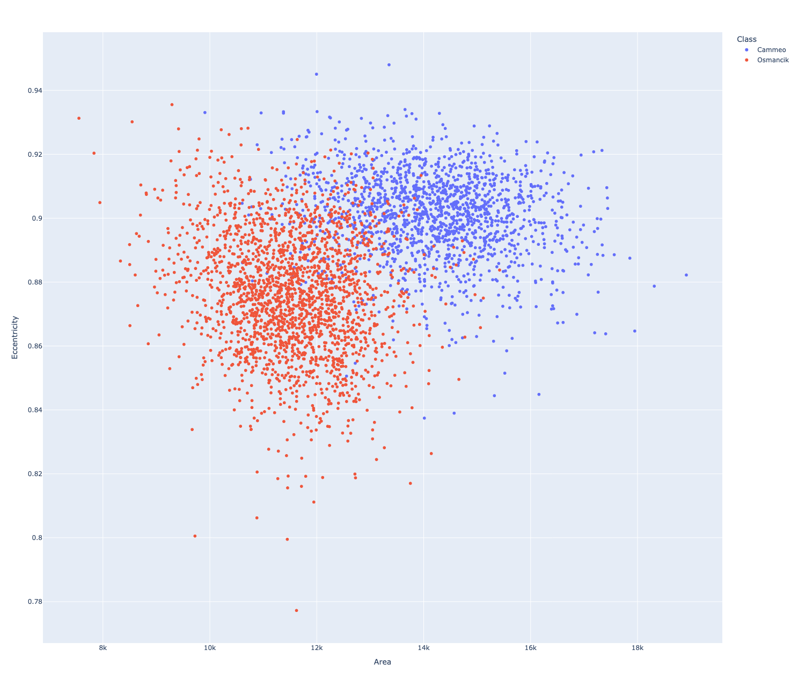
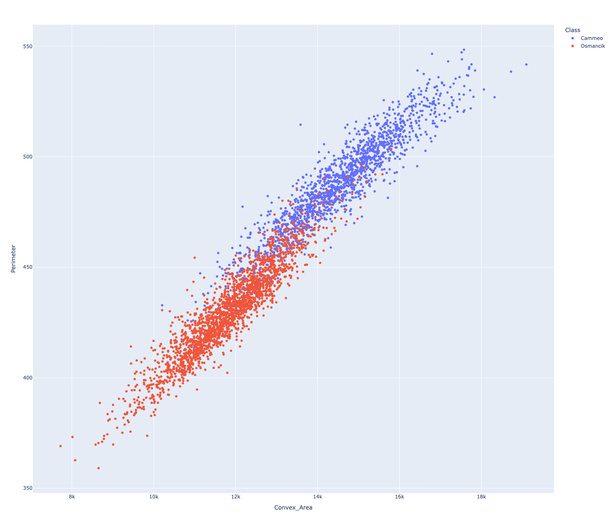
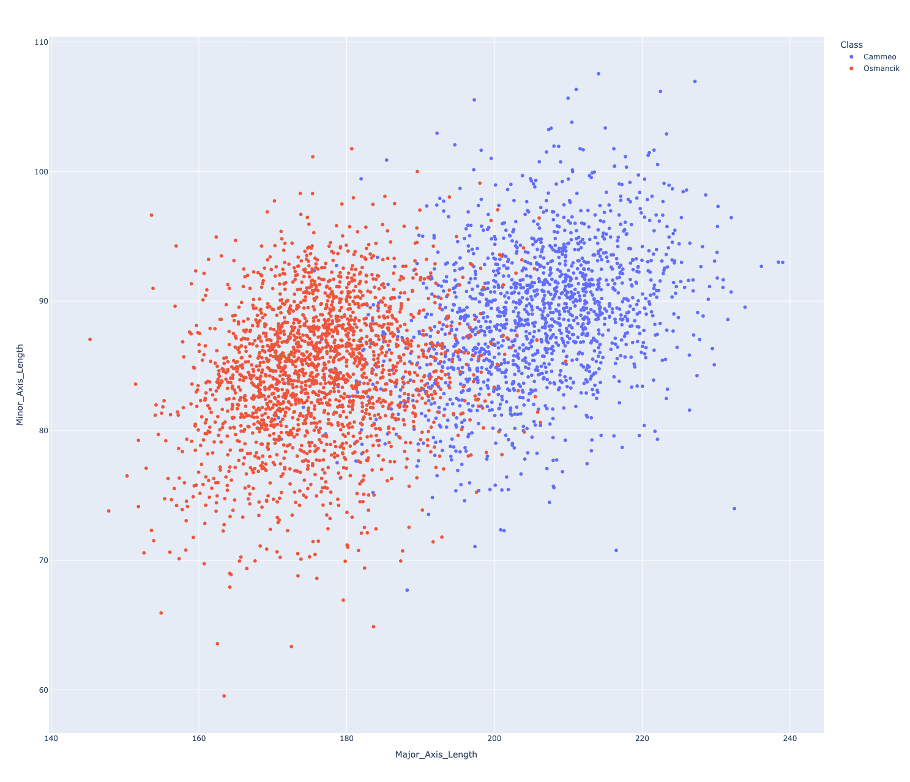
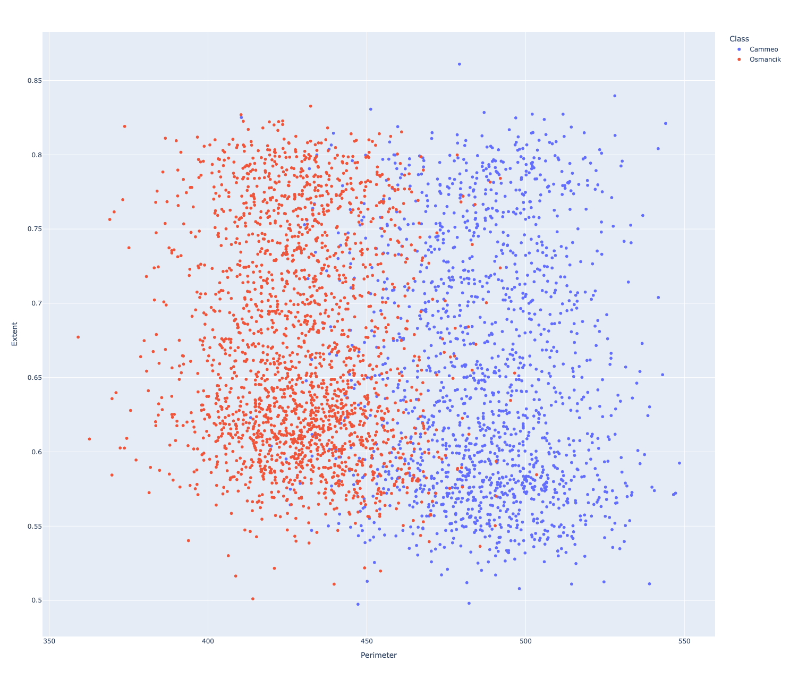
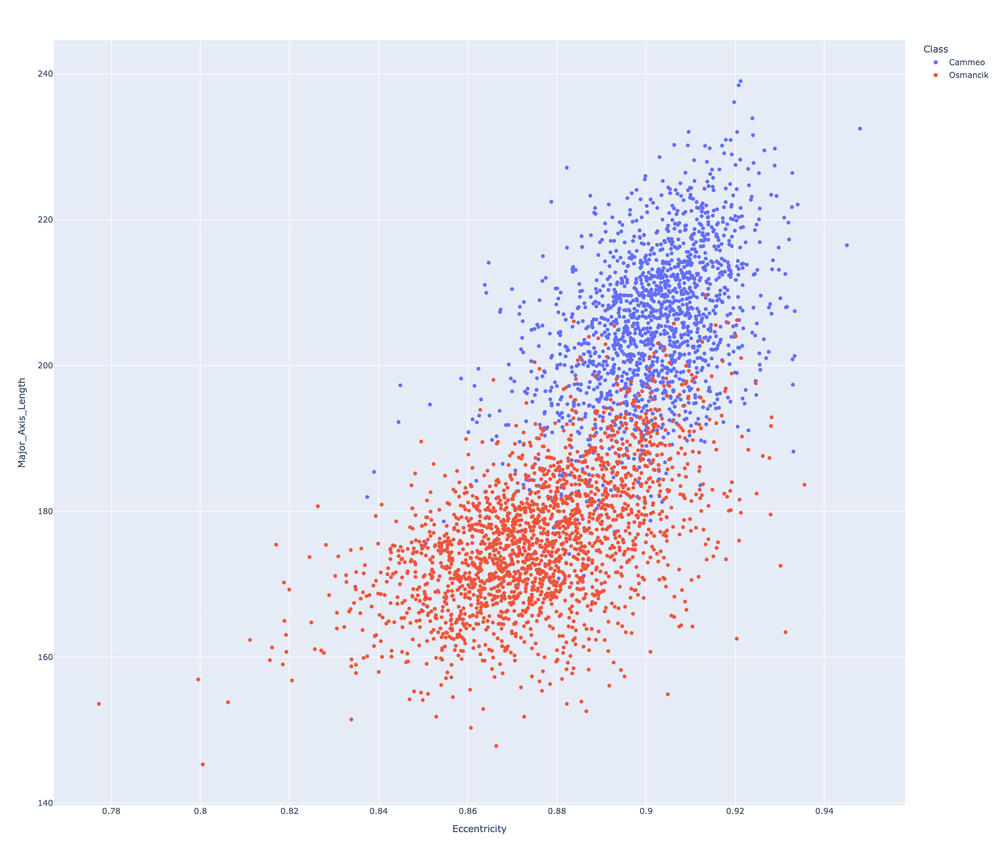
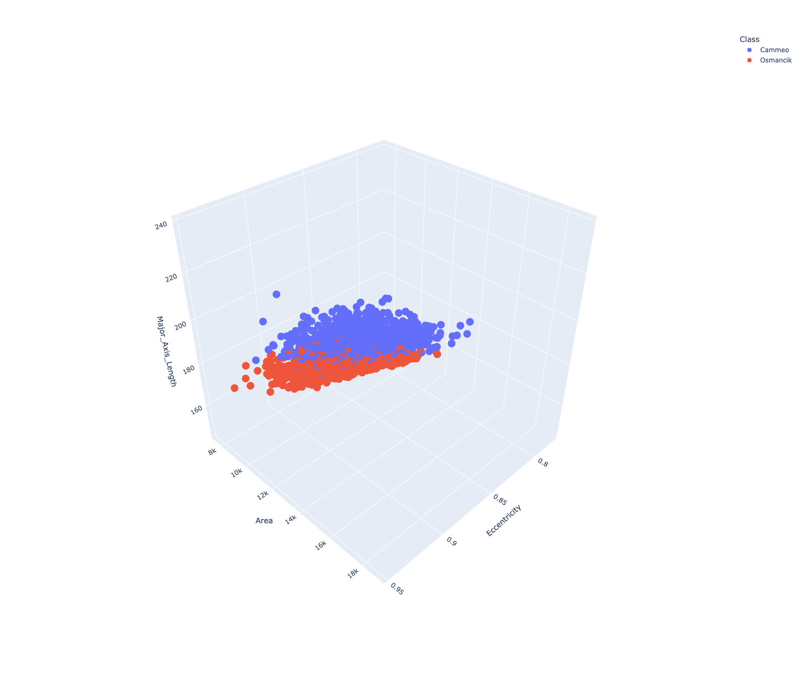

# Machine learning 
## Linear Regression Taxi 
### Train a model with one feature
Training a Model to predict the cost of the fare using a single feature. This exemple use TRIP_MILES as the feature for training run. 

### Experiment with hyperparameters
Multiple experiments to find the best set of hyperparameters to train a model.

#### Train a model with two features - Linear Regression 
Training the model with two features, TRIP_MILES and TRIP_MINUTES

## Binary classification
### Explore the dataset
Five 2D plots of the features against each other
Area - Eccentricity

Convex_Area - Perimeter

Major_Axis_Length - Minor_Axis_Length

Perimeter - Extent

Eccentricity - Major_Axis_Length

### Visualize in 3D
 3d Plot on Eccentricity, Major_Axis_Length, and Area
 
