# Machine Learning Projects

This repository contains comprehensive machine learning projects covering linear regression, binary classification, and numerical data analysis.

## Table of Contents
- [Project Overview](#project-overview)
- [Technologies Used](#technologies-used)
- [Projects](#projects)
  - [1. Linear Regression - Chicago Taxi Fare Prediction](#1-linear-regression---chicago-taxi-fare-prediction)
  - [2. Binary Classification - Rice Grain Classification](#2-binary-classification---rice-grain-classification)
  - [3. Numerical Data Analysis](#3-numerical-data-analysis)
- [Installation](#installation)
- [Usage](#usage)
- [Results](#results)

## Project Overview

This repository demonstrates fundamental machine learning concepts through practical implementations:
- **Linear Regression**: Predicting taxi fares using trip metrics
- **Binary Classification**: Classifying rice grain varieties using morphological features
- **Data Analysis**: Exploring numerical datasets and identifying outliers

## Technologies Used

- **Python 3.x**
- **TensorFlow/Keras**: Deep learning framework for model building
- **Pandas**: Data manipulation and analysis
- **NumPy**: Numerical computing
- **Plotly**: Interactive data visualizations
- **Matplotlib**: Static plotting
- **Seaborn**: Statistical data visualization

## Projects

### 1. Linear Regression - Chicago Taxi Fare Prediction

**File**: [linear_regression_taxi_ml.py](linear_regression_taxi_ml.py)

**Dataset**: Chicago Taxi Train Dataset

**Objective**: Build a regression model to predict taxi fare costs based on trip characteristics.

#### Features Used:
- `TRIP_MILES`: Distance traveled
- `TRIP_SECONDS`: Duration of the trip
- `TRIP_MINUTES`: Converted duration (seconds/60)
- `COMPANY`: Taxi company
- `PAYMENT_TYPE`: Method of payment
- `TIP_RATE`: Tip percentage

#### Experiments:

##### Experiment 1: Single Feature Model
Training a model to predict fare using only `TRIP_MILES` as the feature.

**Hyperparameters**:
- Learning Rate: 0.001
- Epochs: 20
- Batch Size: 50

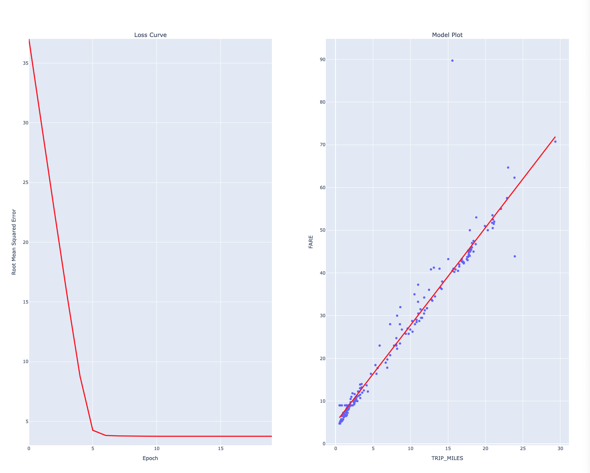

**Key Findings**:
- Converges in approximately 5 epochs
- Model fits sample data fairly well
- TRIP_MILES shows strongest correlation with FARE (0.92)

##### Experiment 2: Hyperparameter Tuning
Multiple experiments to optimize hyperparameters for better model performance.

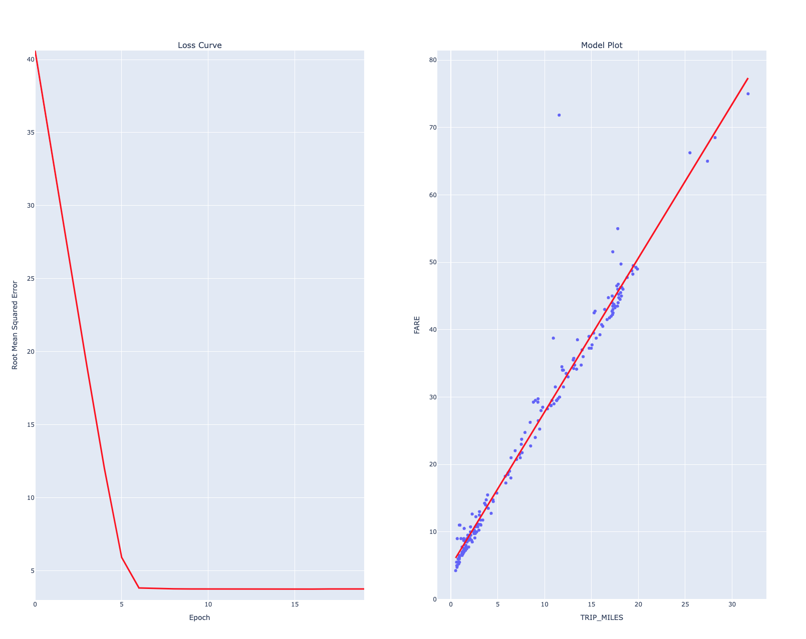

##### Experiment 3: Multi-Feature Model
Training with two features: `TRIP_MILES` and `TRIP_MINUTES`

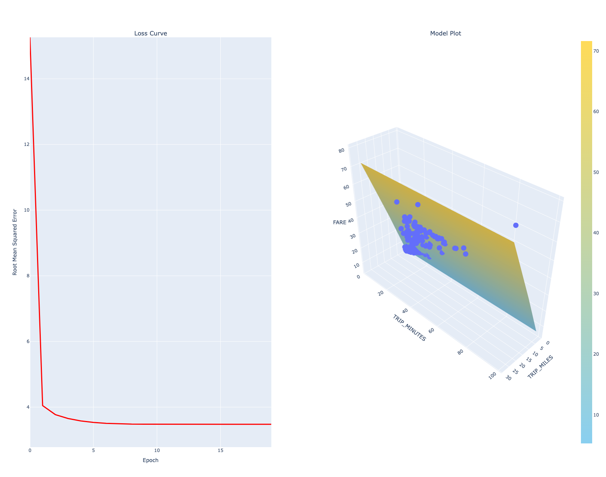

**Model Equation**:
```
FARE = 2.25 * TRIP_MILES + 0.12 * TRIP_MINUTES + 3.25
```

**Performance Improvements**:
- RMSE improvement of ~$0.27 compared to single-feature model
- Better approximation of Chicago's actual taxi fare formula
- Feature scaling (seconds to minutes) improves training stability

#### Model Validation:
- L1 Loss analysis shows predictions within reasonable range of observed values
- Random sampling demonstrates consistent prediction accuracy

---

### 2. Binary Classification - Rice Grain Classification

**File**: [binary_classification_rice_ml.py](binary_classification_rice_ml.py)

**Dataset**: Rice Cammeo Osmancik Dataset

**Objective**: Classify rice grains into two varieties (Cammeo vs. Osmancik) based on morphological features.

#### Features:
- `Area`: Grain area in pixels
- `Perimeter`: Grain perimeter measurement
- `Major_Axis_Length`: Length of major axis
- `Minor_Axis_Length`: Length of minor axis
- `Eccentricity`: Measure of grain shape elongation
- `Convex_Area`: Convex hull area
- `Extent`: Ratio of grain area to bounding box area

#### Dataset Statistics:
- Shortest grain: Varies by feature
- Largest grain perimeter: ~5.1 standard deviations from mean
- Total samples: Split into 80% training, 10% validation, 10% test

#### Data Exploration:

Five 2D scatter plots showing feature relationships:

**Area vs Eccentricity**
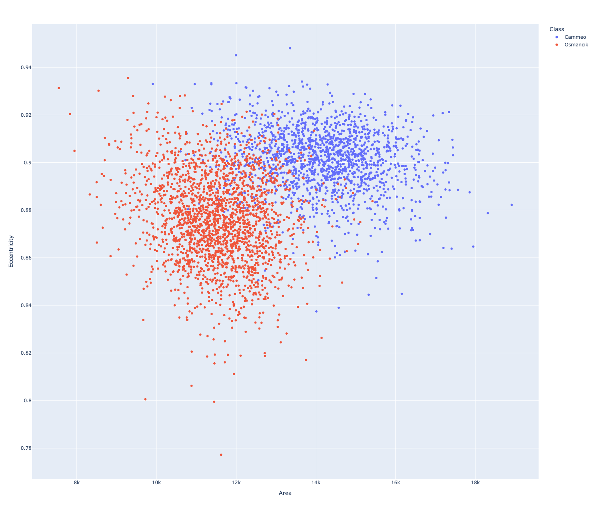

**Convex Area vs Perimeter**
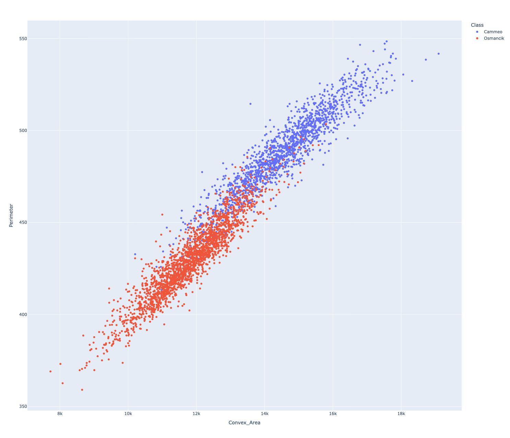

**Major Axis Length vs Minor Axis Length**
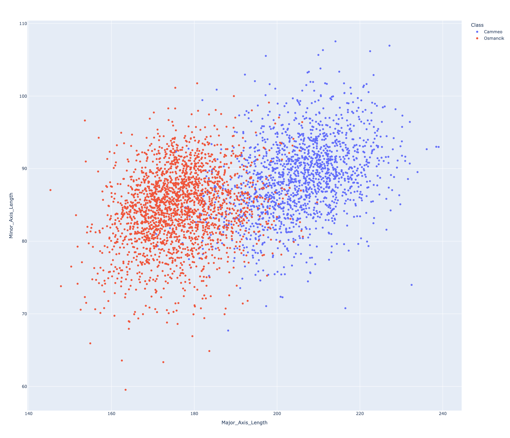

**Perimeter vs Extent**
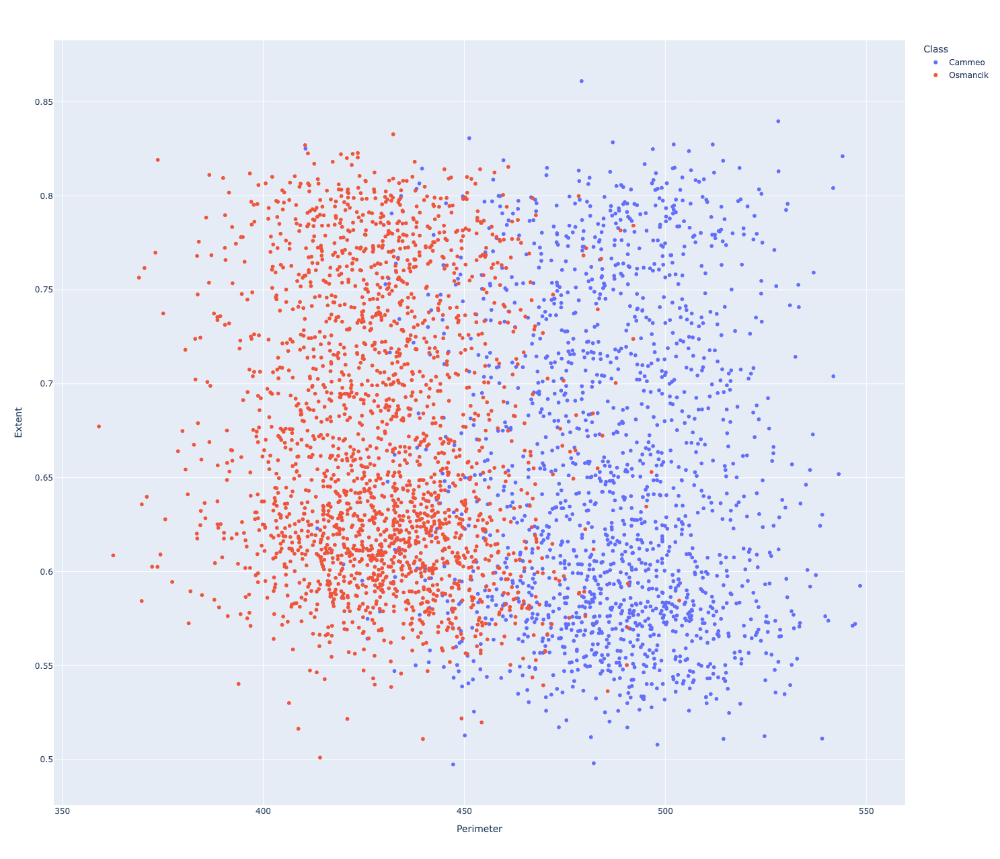

**Eccentricity vs Major Axis Length**
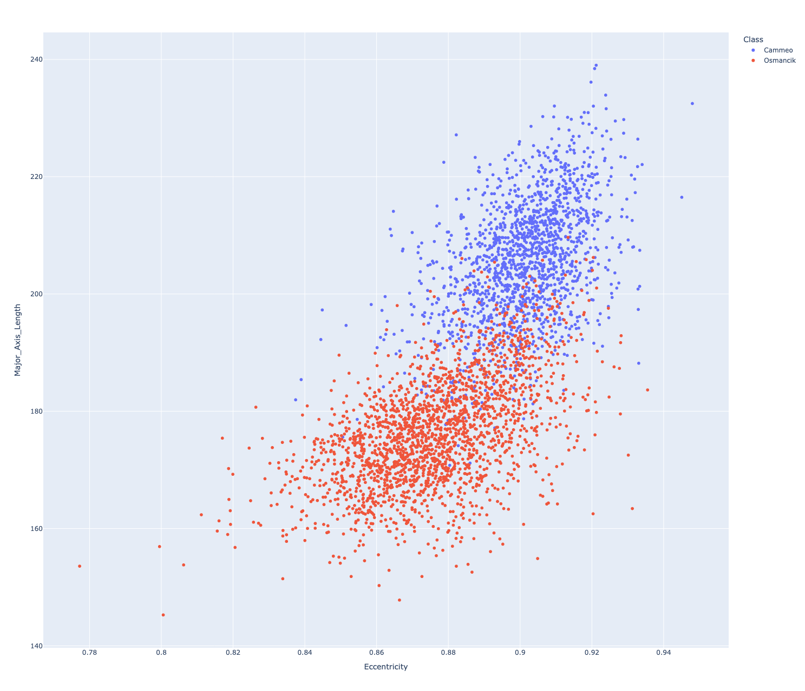

#### 3D Visualization:
3D scatter plot showing relationship between Eccentricity, Major_Axis_Length, and Area:

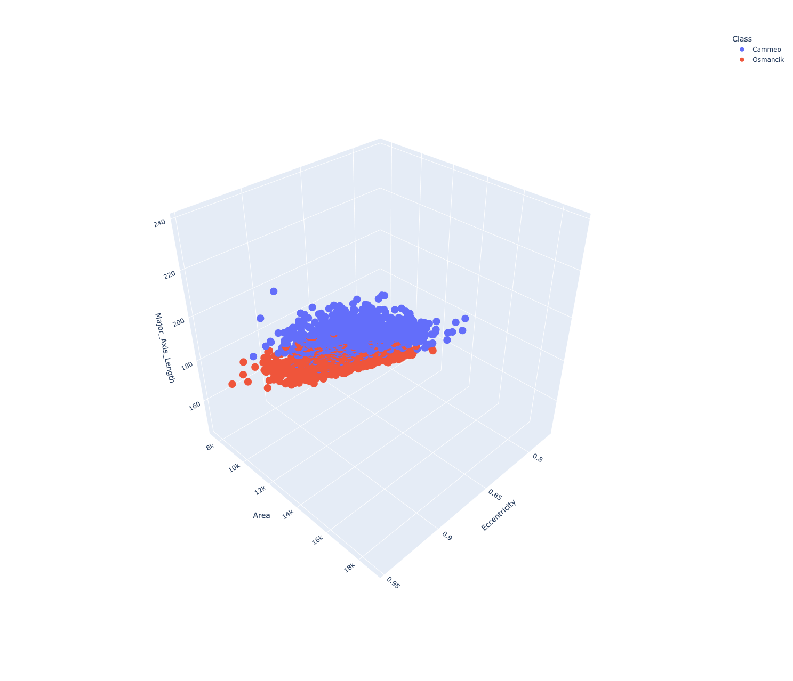

#### Model Architecture:
- **Input Layer**: Multiple inputs for selected features
- **Dense Layer**: Single neuron with sigmoid activation
- **Loss Function**: Binary Cross-Entropy
- **Optimizer**: RMSprop
- **Metrics**: Accuracy, Precision, Recall, AUC

#### Training Configuration:

**Baseline Experiment**:
- Features: Eccentricity, Major_Axis_Length, Area
- Learning Rate: 0.001
- Epochs: 60
- Batch Size: 100
- Classification Threshold: 0.35

**Full-Featured Experiment**:
- All 7 features included
- Classification Threshold: 0.5
- Improved accuracy and AUC metrics

#### Data Preprocessing:
- Z-score normalization applied to all numerical features
- Binary labels: Cammeo = 1, Osmancik = 0
- Random shuffling with reproducible seed (42)

#### Model Evaluation:
- Train vs Test metric comparison
- AUC curve analysis
- Precision-Recall trade-off visualization

---

### 3. Numerical Data Analysis

#### 3.1 California Housing Data
**File**: [numerical_data_ml.py](numerical_data_ml.py)

**Dataset**: California Housing Train Dataset

**Objective**: Identify outliers and analyze numerical data distributions.

**Analysis Results**:
- Columns with potential outliers:
  - `total_rooms`
  - `total_bedrooms`
  - `population`
  - `households`
  - `median_income` (possibly)

**Outlier Indicators**:
- Standard deviation approximately equal to mean
- Large delta between 75th percentile and maximum
- Small delta between minimum and 25th percentile

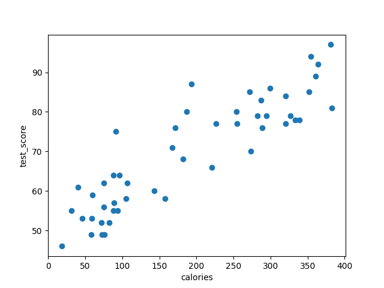

#### 3.2 Test Score vs Calories Analysis
**File**: [numerical_data_bad_values_ml.py](numerical_data_bad_values_ml.py)

**Dataset**: Custom dataset tracking calories and test scores

**Objective**: Detect anomalies and bad data values.

**Key Findings**:
- Dataset spans 4 weeks, 7 days per week, 50 subjects per day
- Day 4 (Thursday) shows anomalous calorie values (0-200 range)
- Other days show normal range (0-400 calories)

**Statistical Confirmation**:
- Mean Thursday calories: Significantly lower
- Mean non-Thursday calories: Within expected range

**Visualizations by Day**:
<div style="display: flex; flex-wrap: wrap;">
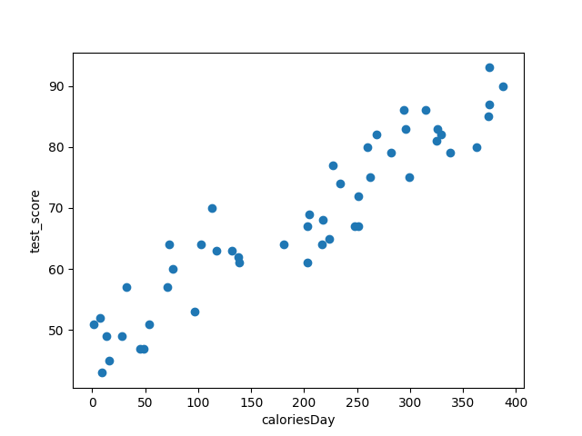
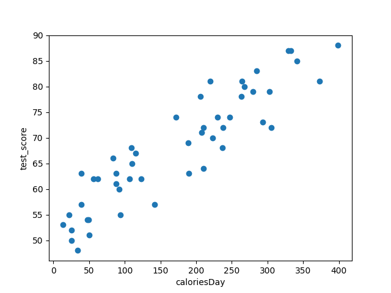
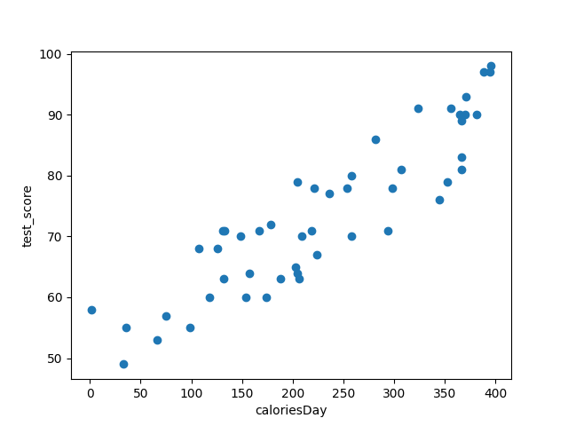
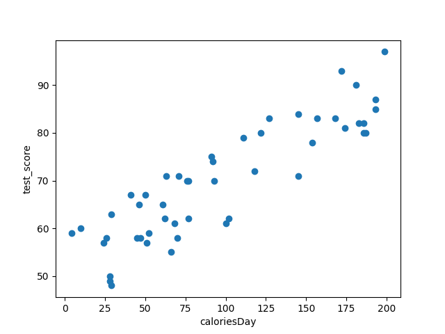
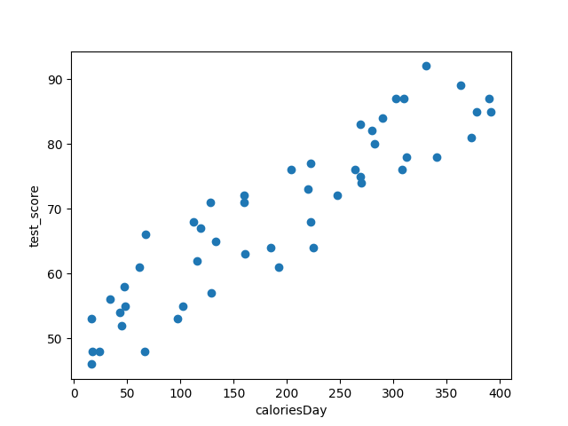
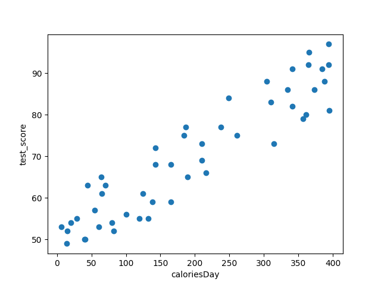
</div>

---

## Installation

1. Clone the repository:
```bash
git clone <repository-url>
cd MachineLearning_linerar_regression_taxi
```

2. Install required dependencies:
```bash
pip install pandas numpy keras tensorflow plotly matplotlib seaborn
```

3. Ensure you have Python 3.x installed

## Usage

### Running Linear Regression:
```bash
python linear_regression_taxi_ml.py
```

### Running Binary Classification:
```bash
python binary_classification_rice_ml.py
```

### Running Numerical Data Analysis:
```bash
python numerical_data_ml.py
python numerical_data_bad_values_ml.py
```

## Results

### Linear Regression Performance:
- **Single Feature Model**: RMSE varies based on hyperparameters
- **Two Feature Model**: Improved RMSE by ~$0.27
- **Model Accuracy**: Close approximation to Chicago's actual fare calculation formula

### Binary Classification Performance:
- **Baseline Model** (3 features):
  - Train/Test accuracy comparison available
  - AUC metrics tracked
- **Full Model** (7 features):
  - Improved metrics across all measurements
  - Better generalization on test set

### Data Quality Insights:
- Successfully identified outliers in California housing data
- Detected systematic data collection issues (Thursday anomaly)
- Demonstrated statistical methods for data validation

---

## Key Learning Outcomes

1. **Feature Engineering**: Understanding feature correlation and selection
2. **Hyperparameter Tuning**: Optimizing learning rate, epochs, and batch size
3. **Model Evaluation**: Using multiple metrics (RMSE, Accuracy, Precision, Recall, AUC)
4. **Data Preprocessing**: Normalization and scaling techniques
5. **Outlier Detection**: Statistical methods for identifying anomalous data
6. **Visualization**: Effective use of 2D and 3D plots for data exploration

---

## Project Structure
```
MachineLearning_linerar_regression_taxi/
├── linear_regression_taxi_ml.py          # Taxi fare prediction
├── binary_classification_rice_ml.py      # Rice classification
├── numerical_data_ml.py                  # California housing analysis
├── numerical_data_bad_values_ml.py       # Outlier detection
├── chicago_taxi_train.csv                # Local dataset (if available)
├── Screenshot-Experiment-1.png           # Single feature results
├── Screenshot-Experiment-2.png           # Hyperparameter tuning
├── Screenshot-Experiment-3.png           # Two feature results
├── Area-Eccentricity.png                 # Feature visualization
├── Convex_Area-Perimeter.png
├── Major_Axis_Length-Minor_Axis_Length.png
├── Perimeter-Extent.png
├── Eccentricity-Major_Axis_Length.png
├── 3d-plot.png                          # 3D visualization
├── basic_stat.png                       # Statistical analysis
├── day1.png - day6.png                  # Daily visualizations
└── README.md                            # This file
```

---

## License

This project is for educational purposes.

## Acknowledgments

- Dataset sources: Google Machine Learning Crash Course (MLCC)
- Chicago Taxi Dataset
- Rice Cammeo Osmancik Dataset
- California Housing Dataset
